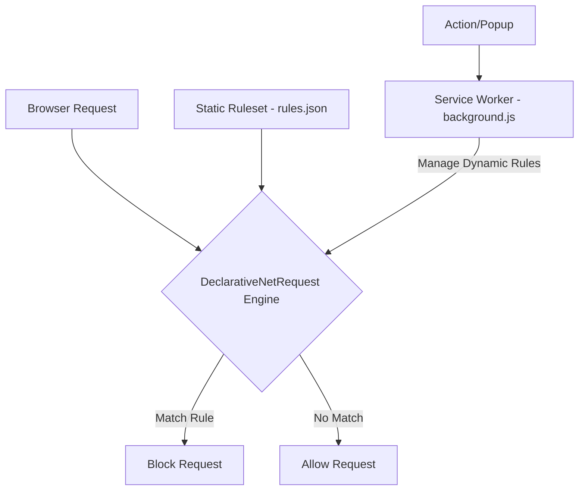

# Project Architecture: BlockMedia Extension

## 1. Overview
BlockMedia is a Chromium-based browser extension (Manifest V3) designed to block all incoming requests for media files, including images (raster/vector), audio, and video. This improves page load speed, reduces data consumption, and provides a "text-only" reading experience.

---

## 2. Core Technologies
- **Manifest V3**: The latest standard for browser extensions.
- **`declarativeNetRequest` (DNR)**: The primary API for blocking network requests. It allows the extension to define rules that the browser executes.
- **JavaScript/TypeScript**: For rule management and potential UI interactions.
- **Vanilla CSS**: For styling the popup or options page.

---

## 3. High-Level Architecture
The extension follows the standard Manifest V3 architecture with a focus on Declarative Rulesets.

### 3.1 Component Diagram (Mermaid)


---

## 4. Key Components

### 4.1 `manifest.json`
The entry point. It declares permissions (`declarativeNetRequest`, `declarativeNetRequestFeedback`) and identifies the static ruleset.

### 4.2 Static Ruleset (`rules.json`)
Contains a list of rules that define what to block. Rules are based on `resourceTypes`:
- `image`: Blocks raster images (PNG, JPG, GIF, WebP).
- `media`: Blocks audio and video files.
- **SVG Issue**: SVGs can sometimes be treated as `image` or `xml_httprequest`. We will use URL pattern matching or broad `image` types to ensure SVG blocking.

### 4.3 Service Worker (`background.js`)
Handles extension lifecycle events. In more advanced versions, it can:
- Toggle blocking On/Off.
- Sync user settings.
- Update dynamic rules for whitelisting.

---

## 5. Blocking Logic Details

### 5.1 Resource Types to Block
| Type | Extension Example | DNR Resource Type |
| :--- | :--- | :--- |
| Raster Image | .png, .jpg, .webp, .gif | `image` |
| Vector Image | .svg | `image`, `other` (sometimes) |
| Audio | .mp3, .wav, .ogg | `media` |
| Video | .mp4, .mkv, .webm | `media` |

### 5.2 Example Rule Structure
```json
{
  "id": 1,
  "priority": 1,
  "action": { "type": "block" },
  "condition": {
    "resourceTypes": ["image", "media"]
  }
}
```

---

## 6. Project Structure
```text
blockimage/
├── manifest.json        # Extension configuration
├── rules.json           # Static blocking rules
├── background.js       # Background service worker
├── icons/               # Extension icons (16, 48, 128)
│   ├── icon16.png
│   └── icon128.png
├── popup/               # (Optional) For UI toggle
│   ├── popup.html
│   └── popup.js
└── architecture.md      # This file
```

---

## 7. Future Considerations
- **Whitelist/Blacklist**: Allow users to bypass blocking on specific domains.
- **Element Hiding**: Hide empty placeholders for blocked media elements.
- **Toggle State**: A unified state to enable/disable the extension globally.
